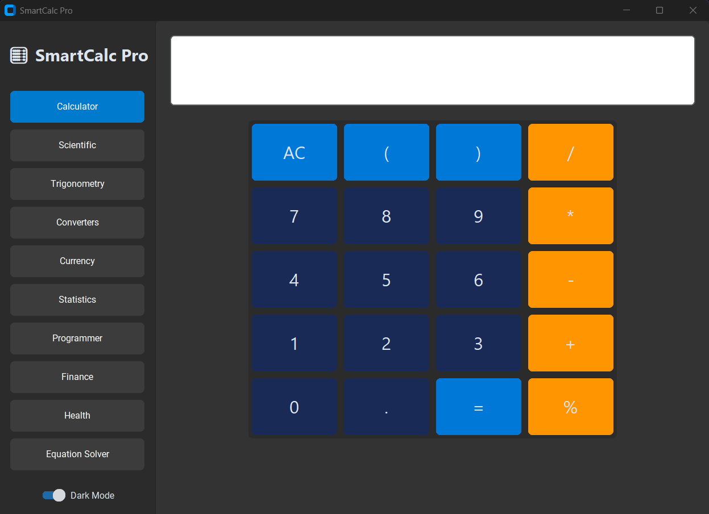
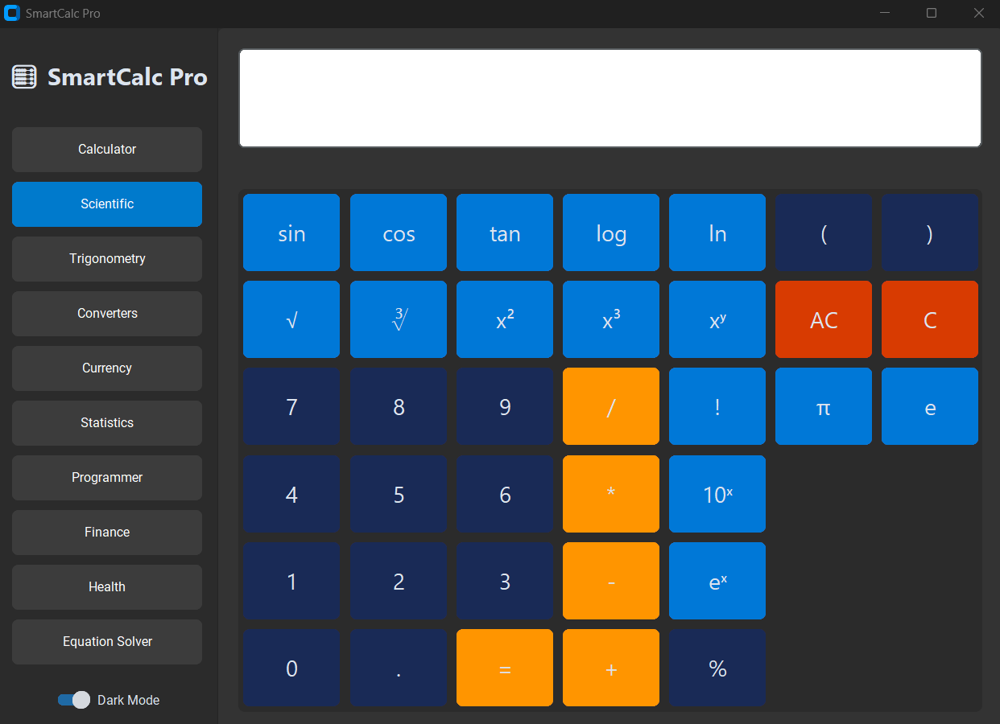
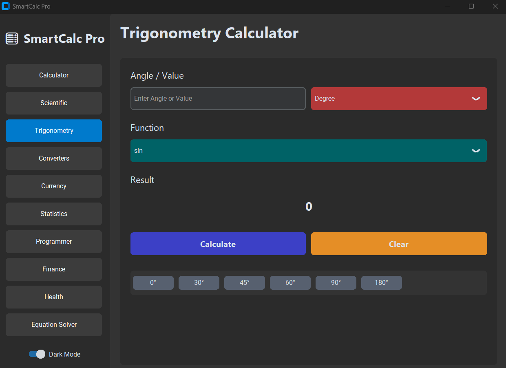
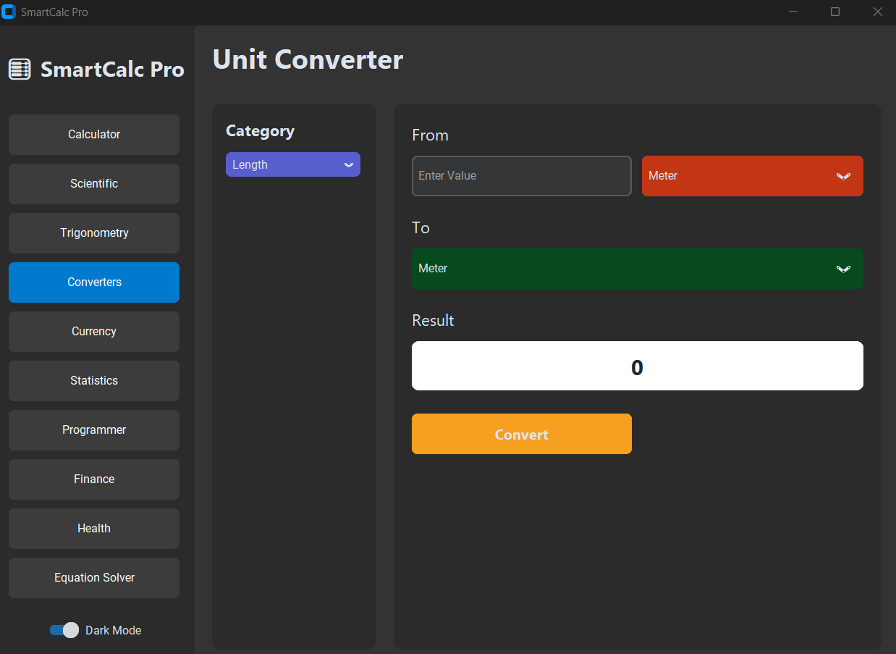
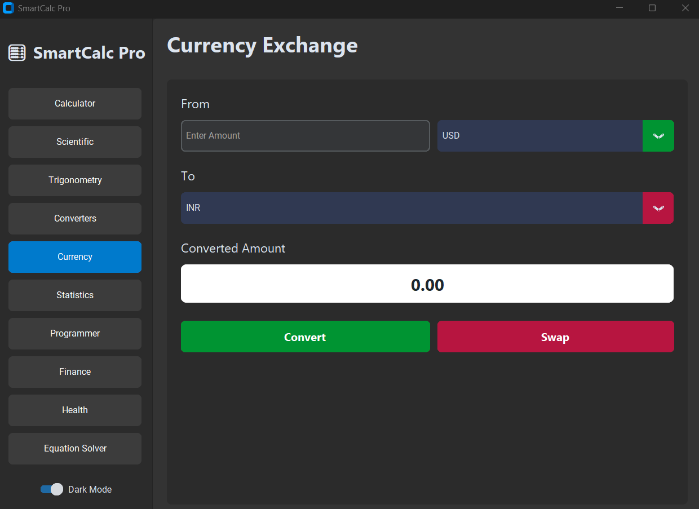
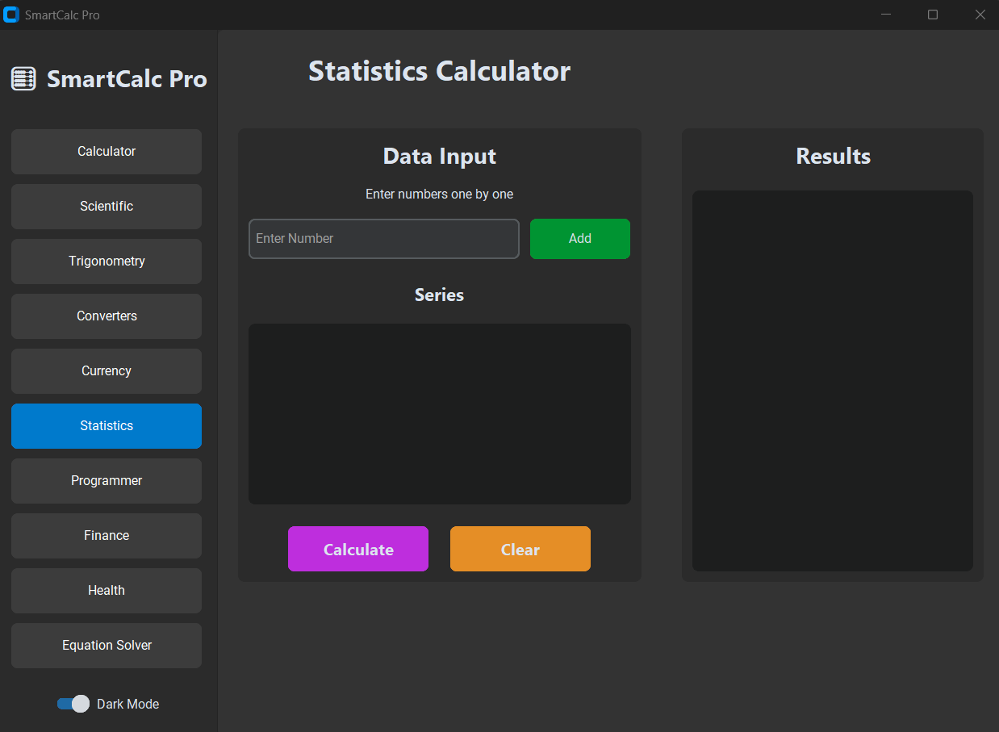
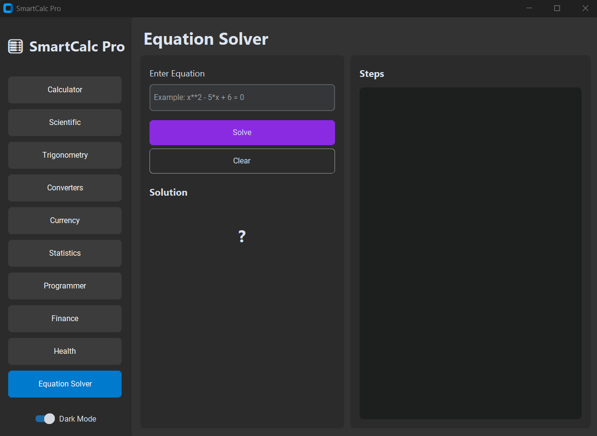
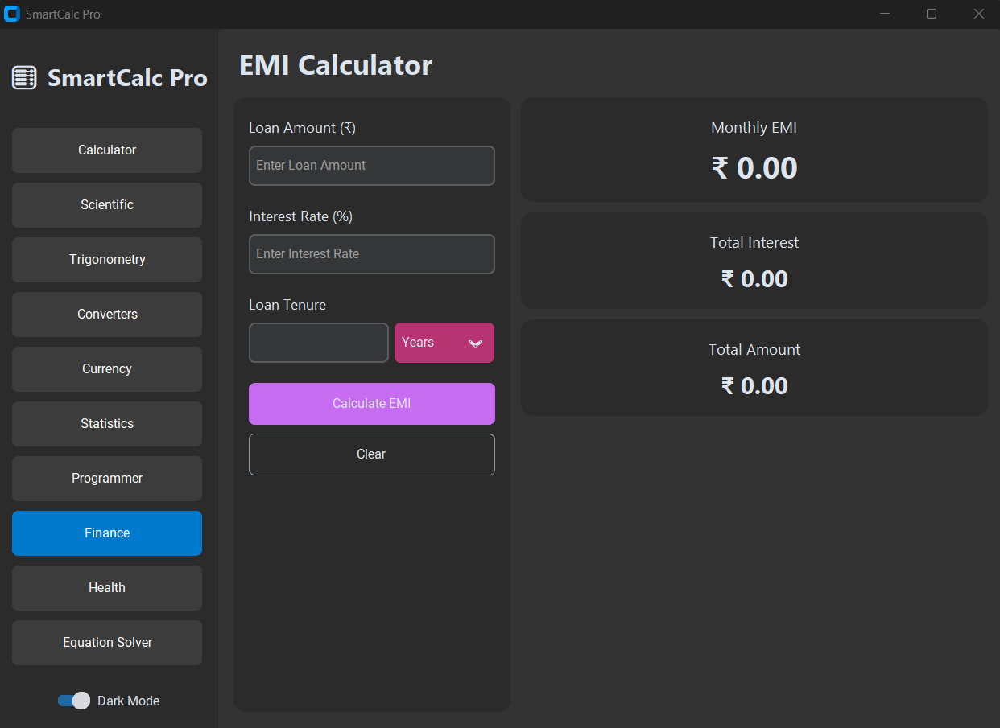
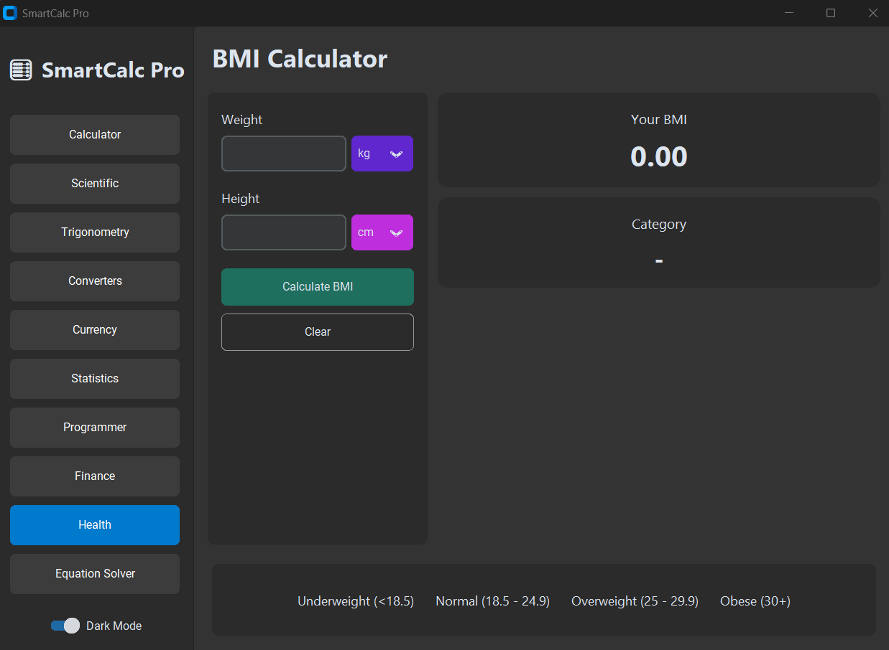

# 🧮 SmartCalc Pro

<div align="center">

### Advanced Multi-Purpose Calculator Application Built with Python & CustomTkinter


</div>

---

## 📌 Project Overview

SmartCalc Pro is a modern desktop application that combines multiple calculators and utility tools into a single platform.

Designed for students, professionals, engineers, analysts, and everyday users, SmartCalc Pro eliminates the need for multiple standalone applications by integrating advanced mathematical, statistical, financial, health, and conversion tools within one intuitive interface.

### 🎯 Key Objectives

- Simplify everyday calculations
- Provide advanced mathematical utilities
- Support financial planning and analysis
- Enable quick statistical analysis
- Deliver a modern desktop experience

---

# 🎥 Project Demonstration

<div align="center">

<a href="https://drive.google.com/file/d/1D16B78Y7HwNJ2CRZNuErQZAvZzcd1pzq/view?usp=sharing">
    
</a>

### ▶️ Click the Thumbnail Above to Watch the Full Demonstration

</div>

---

## 📹 Demo Covers

✅ Application Overview

✅ Standard Calculator

✅ Scientific Calculator

✅ Trigonometry Calculator

✅ Unit Converter

✅ Currency Exchange Calculator

✅ Statistics Calculator

✅ Equation Solver

✅ EMI Calculator

✅ BMI Calculator

✅ Modern User Interface

✅ Error Handling & Validation

---

# ✨ Features

## 🔢 Standard Calculator

Perform daily arithmetic calculations quickly and efficiently.

### Features

- Addition
- Subtraction
- Multiplication
- Division
- Percentage
- Decimal Operations
- Clear & Reset Functions

---

## 🔬 Scientific Calculator

Advanced mathematical computations for academic and professional use.

### Features

- Square Root
- Powers & Exponents
- Logarithm (log)
- Natural Logarithm (ln)
- Factorial
- Pi (π)
- Euler Constant (e)
- Trigonometric Functions

---

## 📐 Trigonometry Calculator

Dedicated trigonometric computation module.

### Features

- Sine (sin)
- Cosine (cos)
- Tangent (tan)
- Cotangent (cot)
- Secant (sec)
- Cosecant (cosec)
- Inverse Trigonometric Functions
- Degree Mode
- Radian Mode

---

## 📏 Unit Converter

Supports conversion across multiple categories.

### Supported Categories

- Length
- Weight
- Temperature
- Area
- Volume
- Speed
- Time
- Pressure
- Energy
- Power
- Data Storage

---

## 💱 Currency Exchange Calculator

Real-time currency conversion using exchange-rate data.

### Features

- Live Exchange Rates
- Multiple Currency Support
- Country-Based Currency Selection
- Fast Conversion
- User-Friendly Interface

---

## 📊 Statistics Calculator

Perform descriptive statistical analysis instantly.

### Available Calculations

- Count
- Sum
- Mean
- Median
- Mode
- Minimum
- Maximum
- Range
- Variance
- Standard Deviation

### Additional Features

- Individual Data Entry
- Dynamic Data Series Generation
- Instant Statistical Summary

---

## 📈 Equation Solver

Solve multiple types of equations using dedicated coefficient inputs.

### Supported Equations

#### Linear Equation

```text
ax + b = c
```

#### Quadratic Equation

```text
ax² + bx + c = 0
```

#### Cubic Equation

```text
ax³ + bx² + cx + d = 0
```

#### Simultaneous Equations (2 Variables)

```text
a₁x + b₁y = c₁
a₂x + b₂y = c₂
```

#### Simultaneous Equations (3 Variables)

```text
a₁x + b₁y + c₁z = d₁
a₂x + b₂y + c₂z = d₂
a₃x + b₃y + c₃z = d₃
```

---

## 💰 Finance Calculator

### EMI Calculator

Calculate loan repayment details instantly.

### Features

- Monthly EMI
- Total Interest Payable
- Total Repayment Amount
- Loan Planning Assistance

---

## ❤️ Health Calculator

### BMI Calculator

Evaluate health status using Body Mass Index.

### Features

- BMI Calculation
- Health Classification
- Weight Assessment

### Categories

- Underweight
- Normal Weight
- Overweight
- Obese

---

# 🖼️ Application Screenshots

## 🏠 Standared Calculator



## 🔬 Scientific Calculator



## 📐 Trigonometry Calculator



## 📏 Unit Converter



## 💱 Currency Exchange Calculator



## 📊 Statistics Calculator



## 📈 Equation Solver



## 💰 EMI Calculator



## ❤️ BMI Calculator



---

# 🛠️ Technologies Used

## Programming Language

- Python

## GUI Framework

- CustomTkinter

## Libraries

- SymPy
- Statistics
- Math
- Requests

## APIs

- Exchange Rate API

## Concepts Applied

- Object-Oriented Programming (OOP)
- Event-Driven Programming
- Dynamic User Interface Design
- Exception Handling
- Data Validation
- Mathematical Computing

---

# 🚀 Installation

## Clone the Repository

```bash
git clone https://github.com/SAAYAN-SAMANTA/SmartCalc-Pro.git
```

## Navigate to Project Directory

```bash
cd SmartCalc-Pro
```

## Install Dependencies

```bash
pip install customtkinter
pip install sympy
pip install requests
```

## Run the Application

```bash
python main.py
```

---

# 🌟 Why SmartCalc Pro?

Unlike traditional calculators that focus only on basic arithmetic operations, SmartCalc Pro provides:

✅ Scientific Computing

✅ Advanced Trigonometric Analysis

✅ Statistical Calculations

✅ Financial Planning Tools

✅ Health Monitoring Utilities

✅ Equation Solving

✅ Real-Time Currency Exchange

✅ Unit Conversion

✅ Modern Multi-Tab User Interface

All integrated into one powerful desktop application.

---

# 📚 Learning Outcomes

This project strengthened my skills in:

- Python Development
- GUI Development
- Mathematical Computing
- API Integration
- Data Validation
- Financial Calculations
- Statistical Analysis
- Software Design Principles

---

# 🚀 Future Enhancements

- Graph Plotter
- Matrix Calculator
- Tax Calculator
- Age Calculator
- Export Results to PDF
- Export Results to Excel
- Statistical Charts & Visualizations
- Loan Comparison Tools
- Advanced Financial Planning Features

---

# 👨‍💻 Author

## Saayan Samanta

Computer Science & Engineering Student

### Areas of Interest

- Data Science
- Artificial Intelligence
- Machine Learning
- Business Intelligence
- Software Development

📧 Email: saayansamanta2003@gmail.com

🐙 GitHub: https://github.com/SAAYAN-SAMANTA

🔗 LinkedIn: https://www.linkedin.com/in/saayan-samanta-103788261/

---

# ⭐ Support

If you found this project useful, consider giving it a ⭐ on GitHub.

Feedback, suggestions, and contributions are always welcome.

---

<div align="center">

# 🚀 SmartCalc Pro

### One Application • Multiple Solutions • Unlimited Possibilities

</div>
